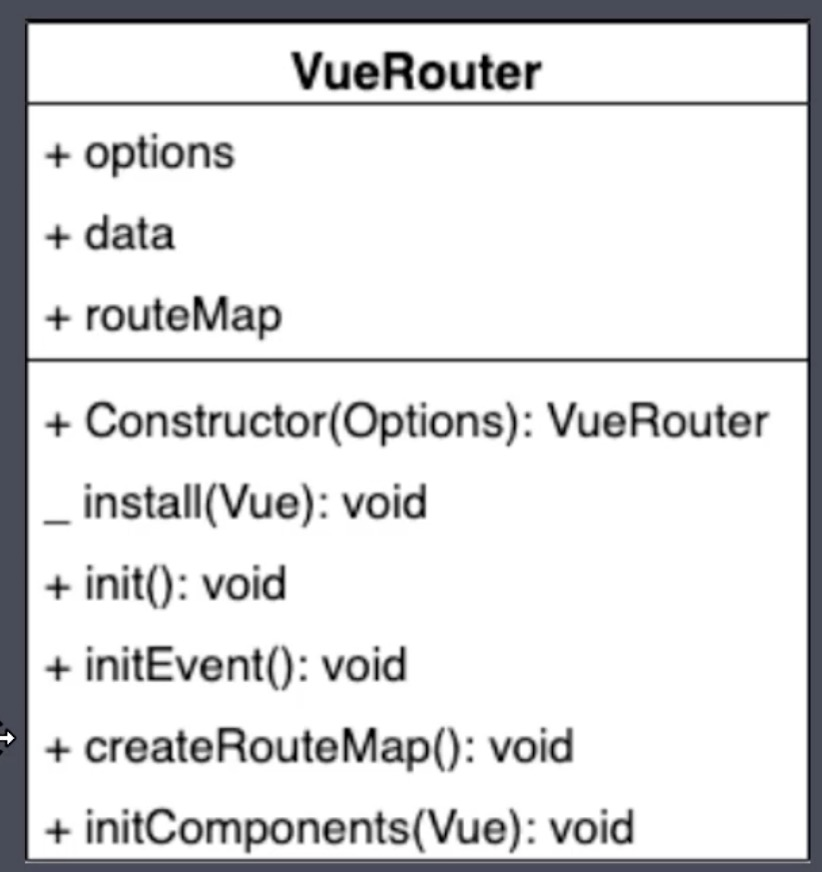

## Vue-router 原理实现
---

#### 基本使用
- 引入 vueRouter
- 创建 vueRouter 实例
- 通过 Vue.use() 注册vueRouter
- 添加 router 到 Vue 的 options

#### 动态路由传参
- $router.params.id
- 通过开启 props: true  可以将参数 注册到组件到props里获取

#### 嵌套路由
- 注意 有路会合并

#### 编程式导航
- this.$router.push(`/`) , this.$router.push({name: Login， params:{}})
- this.$router.replace()  但是不会添加到记录历史
- this.$router.go() 访问记录历史的路由 跳转

#### Hash模式和 History 模式的区别
- 客户端路由 不会 请求服务端， js 监听路由变化 渲染页面
- Hash 带有#号 后面为路由地址
- History 模式 是正常的 但需要服务端的支持
- Hash 模式是基于锚点的， 以及 onhashchange 事件 监听锚点变化
- History 模式 是基于 HTML5 中的 history API
  - histroy pushState()  IE 10 以后支持
  - histroy replaceState()
  - popState 事件 会在点击浏览器前进或后退的时候触发 触发根据当前的路由地址找到对应的组件重新渲染

> history push() 和 history pushState() 区别 push 会改变 url 并添加历史记录会发送服务端请求， pushState 改变地址栏 不会发出请求
> histroy replace() 和 histroy replaceState() 区别 replace 会改变 url 不会添加历史记录会发送服务端请求

#### histroy 模式的使用
- History 需要服务器的支持
- 单页面应用中， 服务端不存在 http://www.baidu.com/login 这样的地址 返回找不到该页面。
- 需要服务端设置 应该除了静态资源外都返回 单页应用的 index.html （典型的是 点击跳转其他路由， 刷新页面 此时如果服务端没有配置history 则此请求 找不到文件）
- 也可以 nginx 配置 try_files

#### vue-router 原理分析

- vueRouter 是一个类， 必须有 install 方法 用于Vue.use() 注册插件
- vueRouter 是一个构造函数，接受 options
- 拥有 currentRouter 当前路由数据， 并是响应式数据，可以用 Vue.observe()
- 拥有 routerMap 记录 路由和组件的map关系
- 以及一些其他的初始化方法
