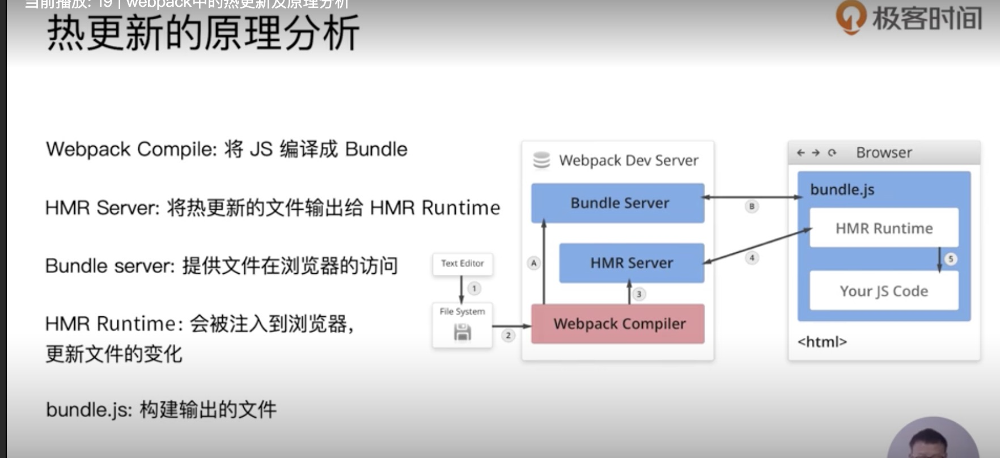
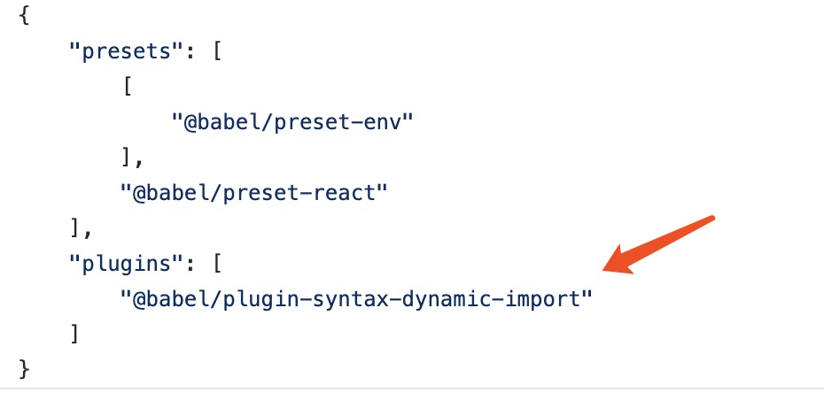
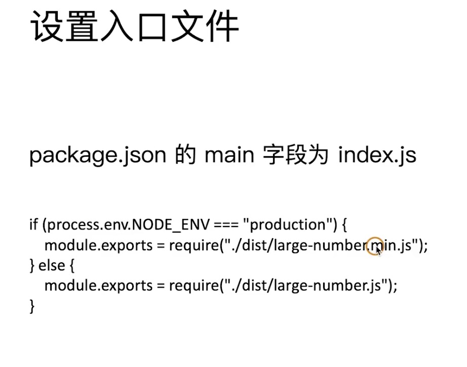

### Webpack 打包

解决问题： 1. 编译 将开发阶段的代码 转换成能够兼容绝大多少环境的代码 2. 打包 将散落的模块文件打包到一起， 减少 http 求情 3. 支持不同类型的资源模块

#### 前端模块打包工具

主流模块打包工具: 1. webpack 2. parcel 3. rollup

- webpack 完全满足我们模块化需求 利用 loader 加载器 处理 资源模块文件 打包， 也可以按需求拆分代码 按需加载。 减少单文件打包过大问题。

## webpack 前端主流的模块打包器

#### 配置文件

- node 执行目下一个 webpack.config.js 文件 commonjs 的 导出一个对象 module.exports = {}
- webpack 处理 过程需要个类 loader 加载器
- webpack4 新增 mode 配置 development ｜ product ｜ none 前两者会调用一些默认的插件配置 处理打包文件， none 默认没有预设的行为

#### webpack 打包结果运行原理

1. webpack 打包后是一个 立即执行函数
2. 函数的参数是一个数组，数组的每一项为一个参数列表相同的函数，函数对应的每一个模块，**从而去实现模块的私有作用域**
3. moduleId 其实就是模块数组的 **元素下标**

#### 资源模块加载

- 默认只会解析 js 文件。 （其他类型文件也会当 js 文件去解析）
- js 以外的其他类型文件 需要相应的 loader 加载器去处理
- 配置文件中 添加 module 配置选项

```js
module: {
  // 其他模块的 加载规则设置
  rules: [
    {
      test: /.css$/, // 匹配遇到的模块文件
      use: ['style-loader', 'css-loader'], // 使用 对应的 loader 处理模块文件 如果配置多个loader 执行顺序是冲后往前执行
    },
  ]
}
```

#### 导入资源模块

- webpack 建议 **_根据代码的需求动态倒入资源_**
- 需要导入资源的 不是应用 而是 代码， （这端代码想要正常的工作就必须要加载对应的资源）
- JS 驱动了整个前端应用，在实现业务上可能需要 css img 等各种资源，从而建立了依赖关系

#### 文件资源加载器

- 图片、字体等资源文件， 通过 file-loader

#### URL 加载器

- url-loader 利用 data URLs 去处理文件
- data URL 可以用来直接去表示一个文件 从而减少 http 请求次数
- data:[<mediaType>][;base64],<data> (协议：文件类型和编码，文件内容)
- 适用项目中体积较小的文件， 如果文件体积较大 就会造成 文件打包体积较大影响运行速度
- 小文件 url-loader 大文件 file-loader
- 需要同时安装 url-loader 和 file-loader 超出 limit 限制的文件会调用 file-loader

```js
{
  test: /.png$/,
  use: {
    loader: 'url-loader',
    options: {
      limit: 10 * 1024 // 10KB   单位 byte
    }
  }
}
```

- 加载器 大致分为三类：
  1. 编译转换类 （将其他文件类型 转换为 js 模块 ep：css-loader / babel-loader）
  2. 文件操作类 （将文件复制到打包目录并向外导出 ep：file-loader）
  3. 代码检查类 （统一代码风格/质量 eg: eslint-loader）

#### webpack 加载资源的方式

1.  ES Moddule
2.  Commonjs
3.  AMD
4.  html 文件标签的 src 属性 等等
5.  样式文件的 @import 和 url 等等

- 不要混合使用
- 项目中 有引用资源的地方都会被 webpack 找出并将资源用对应配置的 loader 去处理到输出目录， 从而去实现整个项目的模块化

### webpack 的核心工作原理

- ==loader 机制 是 webpack 的核心==
- 执行入口文件（通常是 js 文件），然后根据文件的依赖关系，形成一个 模块依赖树，再根据 配置的 rules 利用相应的 loader 递归处理加载的模块， 最终添加到 输出目录的文件中。

\*\*\*\*#### webpack 开发一个 loader

- loader 执行文件需要导出一个函数， 就说对资源文件的处理过程， 最终导出一段 js 模块代码
- 再导出编译的后 js 代码字符串时 可以 是 JSON.Stringify() 先处理一下 可以避免一些 引号和换行符 的问题
- 第二种方式 loader 的处理可以是管道式的 最总导出编译的 js 代码

例如： 处理 markdown 文件

```js
// webapck.config.js
{
  test: /.md$/,
  use: [
    'html-loader',
    './markdown-loader'
  ]
},

// markdown-loader.js

// loader 需要导出一个函数  就是对加载资源的处理过程
// 返回 一段 js  用户打包编译的模块内容
// JSON.stringify()   会处理掉 html 的银行和换行符的一些问题
// 最终编译js模块内容 需要导出模块内容  就跟js模块一样
const marked = require('marked')
module.exports = source => {
  const html = marked(source)
  // return `module.exports = ${JSON.stringify(html)}`
  // return `export default ${JSON.stringify(html)}`

  /**
   * 第二种方式 返回 html 字符串 交给下个 loader 去处理
   */
  return html
}
```

#### 插件机制

- 为了增强 webpack 的 自动化能力
- loader 专注实现资源模块加载
- **Plugin 解决出了资源加载意外的其他自动化工作** e.g. 打包前清除 dist 目录， 压缩输出的代码 等等

#### 自动清除插件

- clean-webpack-plugin
- 打包前清除 原 dist 目录

#### 自动生成 html 插件

- html-webpack-plugin
- 会根据模版自动生成 html 文件，让 html 参与构建过程,并且 webpack 会自动引入 生成 bundle.js 文件
- 可以自定义输出一些文件内容
- 生成多个 html 文件

  ```js
   plugins: [
    new CleanWebpackPlugin(),
    //  用于生成 index.html
    new HtmlWebpackPlugin({
      title: 'webpack plugin',      // html 的title
      meta: {
        viewport: 'width=device-width'  // meta 标签的
      },
      template: './src/index.html'   // html 模版，  htmlWebpackPlugin 内部默认有ejs 模版
    })，
    // 用于生成 about.html
    new HtmlWebpackPlugin({
      filename: 'about.html'
    })
  ]
  ```

  ### webpack 一些不想编译 却需要导入 打包目录的文件处理

  - copy-webpack-plugin

  ```js
  // 开发阶段不需要此插件
  new CopyWebpackPlugin({
    patterns: [{ from: 'public', to: 'public' }],
  })
  ```

  #### 插件的工作原理

  - plugin 通过钩子机制实现
  - webpack 编译 分为几个阶段（好比生命周期） 可以执行钩子函数
  - ==plugin 必须是一个函数 或者是 包含 apply 方法的 一个对象==
  - plugin 接收一个 ==compiler== 对象 是 webpack 工作的核心对象， 对象中包含了 此次 构建的所有配置信息， 也是通过这个 对象 去注册钩子函数
  - 通过往 webpack 生命周期的 钩子中 挂在 钩子函数实现 插件功能
    e.g.

  ```js
  // 去除 bundle.js 每行前的 注释plugin
  class MyPlugin {
    apply(compiler) {
      // console.log(compiler)
      compiler.hooks.emit.tap('MyPlugin', compilation => {
        // compilation => 可以理解为此次打包的 上下文
        for (const fileName in compilation.assets) {
          // console.log( compilation.assets[fileName].source())
          if (fileName.endsWith('.js')) {
            const contents = compilation.assets[fileName].source()
            const withoutComments = contents.replace(/\/\*+\*\//g, '')
            compilation.assets[fileName] = {
              source: () => withoutComments,
              size: () => withoutComments.length,
            }
          }
        }
      })
    }
  }
  ```

#### 开发体验

- 设想： 理想的开发环境
- 1. 以 HTTP Server 运行
- 2. 自动编译 + 自动刷新
- 3. 提供 suorce Map 支持

##### 自动编译

- 启动 webpack 的 watch 模式
- yarn webpack --watch
- 会监听文件变化 自动编译
- 机制是 轮训判断文件的最后修改时间是否发生变化
- 某个文件发生变化了，并不会立即告诉监听者，而是缓存起来等 aggregateTimeout 设置的时间

##### Dev Server

- webpack-dev-server
- webpack 提供的 用于开发的 HTTP Server 服务器
- 集成【自动编译】和【自动刷新浏览器】等功能
- 将编译后的内容 存放在内存中， 减少磁盘读写操作， 提高构建效率

##### Webpack-dev-server 静态资源文件访问

- 只要能通过 webpack 打包正常输出的文件都可以被访问到。
- 静态资源也需要被访问的话，就需要额外通知 dev-server

```js
devServer: {
    // 静态资源路径   ‘’ or []
    contentBase: './pulic'
  },
```



##### webpack-dev-server 代理 API

- 本地开发 请求 解决 跨域 问题

e.g

```js
proxy: {
  '/api': {
    // http://localhost:8080/api/users => https://api.github.com/api/users
    target: 'https://api.github.com',
    // http://localhost:8080/api/users => https://api.github.com/users
    patchRewrite: {   // 路径重写
      '^/api': ''  // 会利用正则匹配
    },
    // 不能使用 localhost:8080 作为请求的 主机名
    changeOrigin: true
  }
}
```

##### source Map

- 编译代码 和 源代码的 一个映射关系， 方便定位源代码的错误信息
- 编译文件最后会有一行注释，表示引入 map 文件。
- ```js
  //# sourceMappingURL=bundle.js.map
  ```
- 配置项

```js
// 定义一些开发过程中的辅助工具
  devtool: 'source-map',
```

- webpack 支持 12 中 source-map 方式， 每种方式的 效率和效果都不同
- webpack 配置对象可以是一个数组， 数组中的每个对象是单独的打包配置。这样可以一个打包过程执行多个打包任务

#### source Map 最终模式浅析

1.  eval - 是否使用 eval 执行模块代码
2.  chea - source Map 是否包含行信息
3.  moudle - 是否可以得到 loader 处理前的源代码

#### 选择合适的 source Map

1. 开发模式 cheap-module-eval-souce-map
2. 生产模式 none
3. 在开发中没有觉得通用法则

#### 开发中页面会有一些输入状态， 理想是更新代码， 页面输入状态保留。

#### Hot Module Replacement 模块热替换

- 实现开发时 页面模块的替换 热更新，而不是刷新页面，从而保留页面当时的状态
- 是 webpack 最核心的技能之一
- 集成在 webpack-dev-server 中
- webpack-dev-server --hot

```js
 devServer: {
    // 热更新 配置
    hot: true,    // 热替换 出错 会 刷新页面
    hotOnly: true  // 出错不会刷新页面
 }
 // 同时引入webpack内置插件
 pulugins: [
   new webpack.HotModuleReplacementPlugin()
 ]
```

- webpack 中的 HMR 并不是开箱即用，还需要配置一些 替换逻辑
- 替换资源模块内容，一些有 规律的 导出方便替换 所以不用逻辑处理（例如，框架，css 文件）
- module.hot.accept('模块路径'， callback)
- webpack 没发提供一个通用的 模块替换方案

#### 不同环境的下配置

- webpack.config.js 支持导出一个函数
- 根据环境变量导出不同的配置 （适用于中小型项目）

  ```js
  //webpack-cli 运行的   env 环境参数  argv 运行的所有参数
  mudolue.exports = function (env, argv) {
    let config = {}
    if (env === 'production') {
    }
    return config
  }
  ```

  #### 不用环境下 多配置文件

  - 一般至少会有 3 个配置文件 其中 2 个是用来适配不同的环境的，另外一个是公共的配置
  - webpack-merge 插件 可以帮助 合并 配置文件。

  ```js
  const common = require('webpack.common')
  const merge = require('webpack-merge')
  mudule.export = merge(common, {
   mode: 'production',
   plugins: [...]
  })
  ```

  - 利用 webpack --config 制定配置文件
  - 可以将 命令 添加到 package.json 的 scripts 里

  #### DefinePlugin

  - webpack 自带模块
  - mode：production 会自动开启，并注入 process.env.NODE_ENV
  - 为代码注入全局成员
  - DefinePlugin 允许在 编译时 创建配置的全局常量，这在需要区分开发模式与生产模式进行不同的操作时，非常有用

  ```js
  // 接受一个对象 ， 每个key 会注入到代码当中 value 是一个js 代码片段
  new webpack.DefinePlugin({
    // API_BASE_URL: '"https://api.example.com"'
    API_BASE_URL: JSON.stringify('https://api.example.com'),
  })
  ```

  #### Tree-Shaking

  - ESM 只能出现在顶层
  - 移除 dead-code 未引用代码
  - 只能是 ESModal, 需要静态分析
  - 生产模式下自动弃用， 是一种 优化效果
  - 原理 会在 静态分析阶段，将 dead-code 用注视 标记， 然后在 gulify 阶段 将哪些标记的代码去掉
  - tree Shaking 的代码 不能有副作用， 不然会失效

  #### webpack 模块合并

  - concatenateModules 告知 webpack 去寻找模块图形中的片段，哪些是可以安全地被合并到单一模块中
  - 减少运行速度，和代码体积 webpack3 提供的功能

#### Tree-Shaking & babel

- Tree-Shaking 只在 ESM 下实现
- babal 会转换 ESM -》 Commonjs 默认配置 module：auto 根据环境判断
- 可以手动规定 module 的 配置项

#### SideEffect 副作用选项

- 会规避掉 哪些 导出缺没有使用的代码， 和一些没副作用的 模块文件。
- 使用 需要在 pakage.json 中 开启 sideEffect： true 或者 配置一些 忽略文件 sideEffect：[ '*.css'] 传递需要保留副作用的代码文件
- 可以换个角度来想, sideEffects 是通知 webpack 该模块是可以安全的 tree-shaking 的, 无需关心其副作用。

#### 代码分割

- 由于项目过大，导致模块较多，打包到一个文件就会造成 文件体积过大
- 并不是每个模块的在启动时都是必要的
- 更合理的方式是 代码分割 ，根据运行需要按需加载
- 代码分包/分割， 按不同的响应规则，打包不同的 文件
- 两种方式
  1.  多入口打包
  2.  ESM 动态导入 动态导入的模块会单独输出到一个 bundle.js 中

#### 多入口打包

- entry 配置 接受一个对象， 配置多个入口文件， key 为 入口文件名称， value 为入口文件路径
  ```js
  entry: {
    index: './src/index.js',
    about: './src/about.js'
  }
  ```
- 都个入口就有多个输出文件 output 配置， 可以利用 name 站位符 配置输出文件 name
  ```js
  output: [name].bundle.js
  ```
- 配置多个 html 为念输出 并 制定 对应的模块文件引入， 不然会引入 全部打包模块
- 公共模块 提取 会生成一个额外的 公共打包文件
  ```js
  optimization {
    splitChunks : {
      chunks: 'all'
    }
  }
  ```

#### 按需引入

- 利用 es6 import（） 函数 返回一个 promise 对象， 参数书 module 模块内容

#### 魔法注视

- 可以为动态导入的 bundle 文件 命名
- 如果的 你的 chunkName 是相同的 那么他们就会被打包到一起

```js
import(/* WebpackChunkName: 'index' */ './src/index,js').then(({ default }) => {})
```

#### MiniCssExtractPlugin

- 是一个将 css 文件额外提取出来的 打包插件 提取 css 到单个文件 **可实现 css 文件的按需加载**
- 使用次插件， 就可以不再使用 style-loader（将样式以 style 属性的 形式添加到 html 文件） 了
- 而是说过 MiniCssExtractPlugin.loader 去加载 css 以 link 的方式引入文件
- css 文件大小 超过 150kb 左右考虑使用

#### OptimizationCssAssetsWebpackPlugin

- webpack 生产模式 只 压缩 js 文件， 其他的格式的文件 需要不同的插件去压缩
- 建议 压缩类 插件 放到 optimization 配置下 自定义 压缩插件下

#### 输出文件名 hash

- 一般部署前端资源文件时， 都会使用 静态资源缓存， 减少请求
- 建议生产模式下 文件名使用 Hash ， 这样更新资源文件， 名称会一起变化，
- 对于客户端而言， 全新的文件名就是全新的请求，也就没有缓存的问题
- Hash 的模式有三种

  ```js
  [name].[hash].bundle.js            // 全局的每次打包 所有文件hash一样
  [name].[chunkHash].bundle.js       // 不同打包路径的输出文件拥有形同的 hash
  [name].[contentHash: 8].bundle.js     // 文件即便的hash 根据文件内容改变对应生成相应的额hash
  // : 可以执行 hash 值的位数
  ```

---

#### 基础库的分离

- 思路： 将 react， react-dom 忽略掉， 基础包通过 cdn 引入，不打入 bundle 中
- 方法：
  1.  html-webpack-externals-plugin
  2.  splitChunkPlugin
  3.  分离的包 可以在 htmlWebpackPlugin 插件 chunk 设置中添加引入

#### scope hoisting

- 现象： 构建后的代码存在大量闭包代码
- 导致的问题：
  - 大量闭包的包裹代码，导致体积增大 （模块越多月明显）
  - 运行代码时创建的函数作用域变多，内存开销大
- scope hoisting
  - 原理： 将所有模块代码按照引用顺序放到一个函数作用域里面，然后适当的重命名一些变量以防止命名冲突
  - 对比： 通过 scope hoisting 可以减少函数声明代码和内存开销
  - 必须是 es6 语法， cjs 不支持
  - webpack 4 mode：production 会自动开启

#### 代码分割意义

- 对于大的 web 应用来讲，将所有的代码都放到一个文件显示不够有效的，==特别是某些代码块在某些特殊的时期才会被使用到==，webpack 有个功能是将你的代码分割成 chunk（代码块），当代码运行到需要他们的时候再进行加载。
- 使用场景：
  1.  抽离想通过代码到一个共享块
  2.  懒脚本加载，使得初始化下载的代码更小。
- 懒加载 js 的方式
  1. cjs： require.ensure
  2. es6: 动态 import（） 需要 babel 转译
- 使用 动态 import（）
- 需要安装 babel 插件
  
- 编译后，会通过一个 jsonp 的方式动态请求。

#### eslint

- 两种执行方式
  1. 和 CI/CD 系统集成
  2. 和 webpack 集成
- webpack
  - eslint-loader
  - alloy， airbnb，stander 常用 eslint

#### webpakc 打包库 和 组件

- webpack 除了可以打包应用，也可以用来打包 js 库
- 实现一个大整数加发库的打包 (超出 js 数字最大值仍可计算 通过 string 的形式)
  1. 需要打包压缩版和非压缩版
  2. 支持 AMD/CJS/ESMM 模块引入
     1. 
     2. 如何将库暴露出去 
     3. 针对 min 压抑 
     4. 设置入口文件 
